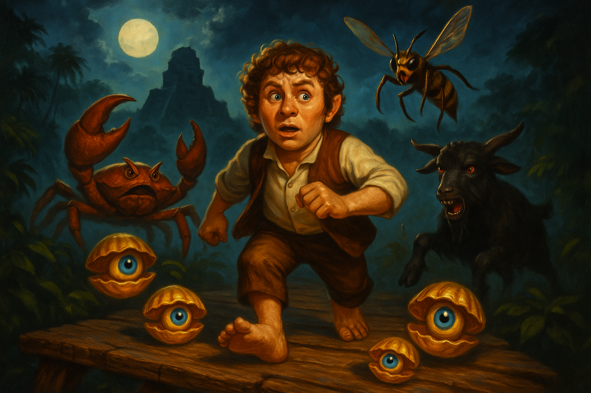

# Dan's Dungeon

Dan's Dungeon is a browser-based retro action platformer built with Phaser 3, TypeScript, and Vite. The current playable is a compact temple run with five connected rooms, relic collection, moving hazards, ladders, pits, score, lives, and a countdown timer.

## Live game

Play the latest deployed build at:

- `https://dpupek.github.io/dungeon-dan/`

## What is in the repo

- `src/game/scenes/` contains the Boot, Title, Game, and End scenes.
- `src/game/runtime/` contains the gameplay runtime modules, actors, and scene-scoped controllers.
- `src/game/state/RunState.ts` owns score, lives, timer, and collected relic state.
- `src/game/data/rooms.ts` is the room-authoring source of truth.
- `public/images/title-box-art-refined.png` is the title graphic loaded by BootScene.
- `public/images/dan-spritesheet.png` is Dan's committed gameplay animation sheet.
- `docs/` contains architecture, room-authoring, debugging, and art-pipeline notes.

## Run locally

1. Install Node.js 20+.
2. From `E:\Sandbox\dungeon-dan`, run `npm install`.
3. Start the dev server with `npm run dev`.
4. Build a production bundle with `npm run build`.
5. Run tests with `npm test`.

## Controls

- Arrow keys or `WASD`: move and climb
- `Space`: jump
- `P`: pause
- `R`: restart the run
- `M`: mute or unmute music
- `[` / `]`: lower or raise music volume

## Developer console

During gameplay, press `` ` `` to open the hidden developer console.

- `[` / `]`: cycle rooms
- `G` / `B`: choose ground floor or basement spawn
- `L` / `Shift+L`: add or remove a life
- `T` / `Shift+T`: add or remove 30 seconds
- `Enter`: jump to the selected room and floor
- `R`: restart the current room without resetting the run

## Project notes

- The browser title and public-facing name should remain `Dan's Dungeon`.
- Dan uses a committed spritesheet, while most other gameplay sprites and textures are still generated in `src/game/scenes/BootScene.ts`.
- The title splash is a static image asset loaded by BootScene from `public/images/title-box-art-refined.png`.
- Sound effects are oscillator-based and do not rely on external audio assets.
- Gameplay music is loaded from a committed audio asset under `public/audio/`.
- Room content is data-driven through typed actor/relic room definitions in `src/game/data/rooms.ts`.

## Title art workflow

Python 3.12 and the `openai` package are used locally for higher-quality title art generation.

1. Set `OPENAI_API_KEY` in your shell or user environment.
2. From `E:\Sandbox\dungeon-dan`, run `python scripts/generate_title_art.py`.
3. Generated images should be written under ignored output paths such as `output/imagegen/title-box-art-api.png`.

You can also point the script at a custom prompt file:
`python scripts/generate_title_art.py --prompt-file docs/title-art-prompt.txt --out output/imagegen/title-box-art-v2.png`

## Architecture

- `src/game/scenes/GameScene.ts` is now the Phaser orchestration shell.
- `src/game/runtime/` owns room assembly, player movement, hazard runtime behavior, relic presentation, HUD rendering, debug tooling, and spawn resolution.
- `src/game/state/RunState.ts` remains the run-level state owner for score, lives, relic persistence, and timer.
- Room content uses archetype-backed actors and relics so animation and behavior defaults are not hardcoded into the scene.

## Docs

- `CONTRIBUTING.md`
- `docs/issue-6-basement-recovery.md`
- `docs/repository-bootstrap.md`
- `docs/game-roadmap.md`
- `docs/conventions.md`
- `docs/asset-inventory.md`
- `docs/gameplay-architecture.md`
- `docs/actor-runtime-refactor/workflows.md`
- `docs/actor-runtime-refactor/crcs.md`
- `docs/actor-runtime-refactor/roadmap.md`
- `docs/room-authoring.md`
- `docs/debugging-checklist.md`
- `docs/music-workflow.md`
- `docs/art-pipeline.md`
